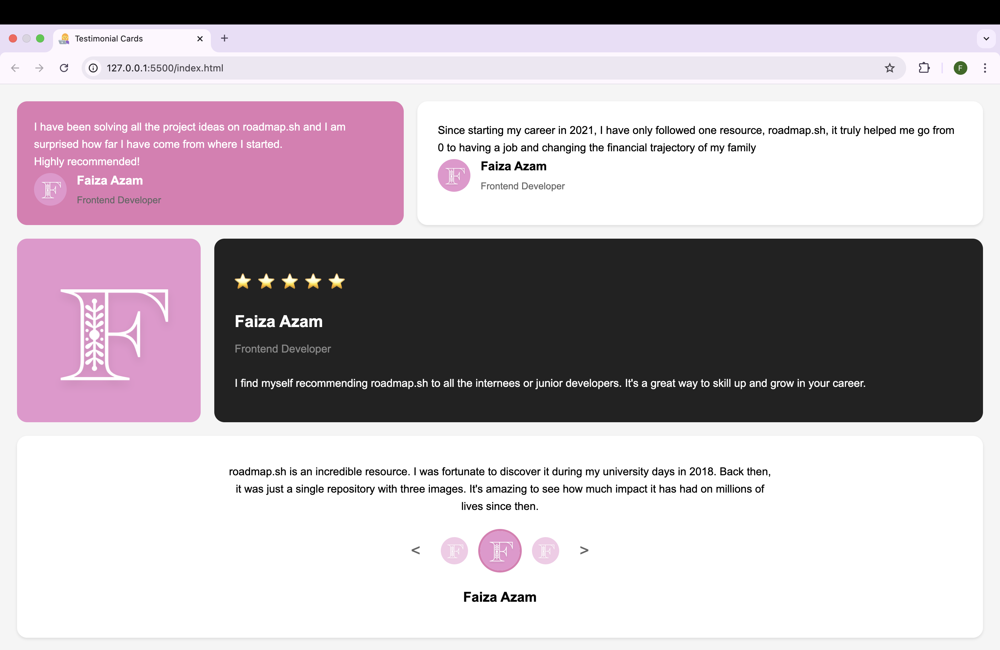

# Testimonial Cards

A collection of responsive testimonial cards built with HTML and CSS. This project is part of the frontend learning path from [roadmap.sh](https://roadmap.sh/frontend).

### Testimonial-card - Preview

## Live Demo
[View Live Demo](https://faizaazam-1.github.io/Testimonial-Cards/)

## Project Overview
This project features different styles of testimonial cards:
- Speech bubble card with avatar
- White rectangular card with user info
- Image card paired with dark themed review
- Bottom carousel with navigation

## Project Requirements
This project is created following the requirements from:
[https://roadmap.sh/projects/testimonial-cards](https://roadmap.sh/projects/testimonial-cards)

## Author
Faiza Azam
- GitHub: [@faizaazam-1](https://github.com/faizaazam-1)
